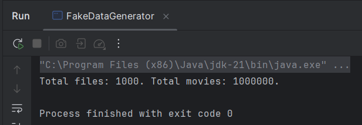
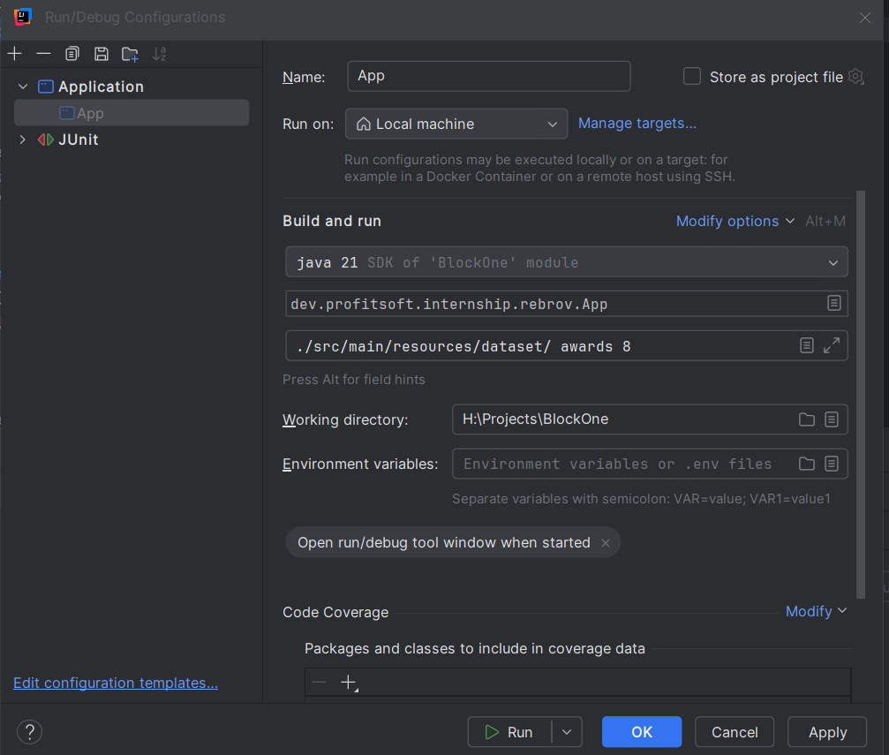

<p style="font-size: 18px; text-align: justify;">
Subject area: cinema and movies.<br/>
In this work, a program was created that allows you to generate statistics based on class attribute values. Files are not loaded completely into RAM; their contents are gradually read using the Jackson iterator. To increase performance, multithreading is used—each file is processed in a separate thread, and the deserialized object from the iterator is immediately transferred to the consumer.<br/>
The consumer is DataProcessorService and its countAttributeValuesByItem method, in which the Reflection API is used to call the getter (or access the value directly from the class attribute if it has “private” or “protected” access level) to obtain the value.<br/>
If the value is a collection or array, all values are obtained. If the attribute is a String containing a comma-separated list, the string is split using split().<br/>
All values are entered into HashMap using the merge function, which allows incrementing with existing values by key.<br/>
The result is transferred to ConcurrentHashMap, which eliminates thread racing.<br/>
The resulting statistics are converted from Map to a sorted list of objects by StatisticsItem value, which is used as a parameter of the Statistics class constructor.<br/>
Next, the statistics are written to an XML file using Jackson. The structure of the XML file is marked in the Statistics class using annotations.</p>


<p style="font-size: 18px">Test environment:</p>
<p style="font-size: 18px">- CPU: Intel i5 9400f 6 cores, 6 threads</p>
<p style="font-size: 18px">- RAM: 16 GB</p>


<p style="font-size: 18px">Total space on hard drive: 286 MB<br>App arguments:</p>



<p style="font-size: 18px">Example of args:</p>
<code>./src/main/resources/dataset/ awards</code>
<code>./src/main/resources/dataset/ director.fullName 6</code>

<p style="font-size: 18px">Experiment with number of threads:</p>
<table style="font-size:  16px">
    <thead>
        <th>Threads</th>
        <th>Time, ms</th>
    </thead>
    <tbody>
        <tr>
            <td>1</td>
            <td>2658ms</td>
        </tr>
        <tr>
            <td>2</td>
            <td>1626</td>
        </tr>
        <tr>
            <td>4</td>
            <td>1112</td>
        </tr>
        <tr>
            <td>6</td>
            <td>993</td>
        </tr><tr>
            <td>8</td>
            <td>995</td>
        </tr>
    </tbody>
</table>

### Input JSON Format:
````
[
    {
      "title" : "A Farewell to Arms",
      "releaseYear" : 1966,
      "genres" : "Fanfiction, Fiction in verse, Realistic fiction, Essay",
      "rating" : 7.2,
      "director" : {
        "fullName" : "Lanny Gibson",
        "country" : "Qatar",
        "birthYear" : 1971
      },
      "awards" : [ "Golden Globe Award", "BAFTA" ]
    }, {
      "title" : "The Widening Gyre",
      "releaseYear" : 2001,
      "genres" : "Comic/Graphic Novel, Speech, Suspense/Thriller, Realistic fiction",
      "rating" : 4.9,
      "director" : {
        "fullName" : "Kirk Greenfelder",
        "country" : "Lesotho",
        "birthYear" : 1953
      },
      "awards" : [ "Golden Globe Award" ]
    }, {
      "title" : "For a Breath I Tarry",
      "releaseYear" : 1959,
      "genres" : "Mystery, Legend",
      "rating" : 9.7,
      "director" : {
        "fullName" : "Maurice Luettgen",
        "country" : "Mongolia",
        "birthYear" : 1964
      },
      "awards" : [ "BAFTA", "Palme d’Or", "Oscar" ]
    }, {
      "title" : "Blue Remembered Earth",
      "releaseYear" : 2010,
      "genres" : "Western, Historical fiction",
      "rating" : 9.9,
      "director" : {
        "fullName" : "Wayne Toy",
        "country" : "Democratic People's Republic of Korea",
        "birthYear" : 1964
      },
      "awards" : [ "BAFTA", "Golden Globe Award", "Palme d’Or" ]
    }, {
      "title" : "Those Barren Leaves, Thrones, Dominations",
      "releaseYear" : 2000,
      "genres" : "Fanfiction, Crime/Detective, Essay",
      "rating" : 2.6,
      "director" : {
        "fullName" : "Waldo Kub",
        "country" : "Gibraltar",
        "birthYear" : 1989
      },
      "awards" : [ "Golden Globe Award" ]
    } 
]
````
### Output XML Format:
````
<?xml version="1.0" encoding="UTF-8"?>
<statistics>
  <item>
    <value>Tall tale</value>
    <count>14</count>
  </item>
  <item>
    <value>Horror</value>
    <count>12</count>
  </item>
  <item>
    <value>Short story</value>
    <count>11</count>
  </item>
  <item>
    <value>Comic/Graphic Novel</value>
    <count>9</count>
  </item>
  <item>
    <value>Fiction narrative</value>
    <count>5</count>
  </item>
</statistics>
````